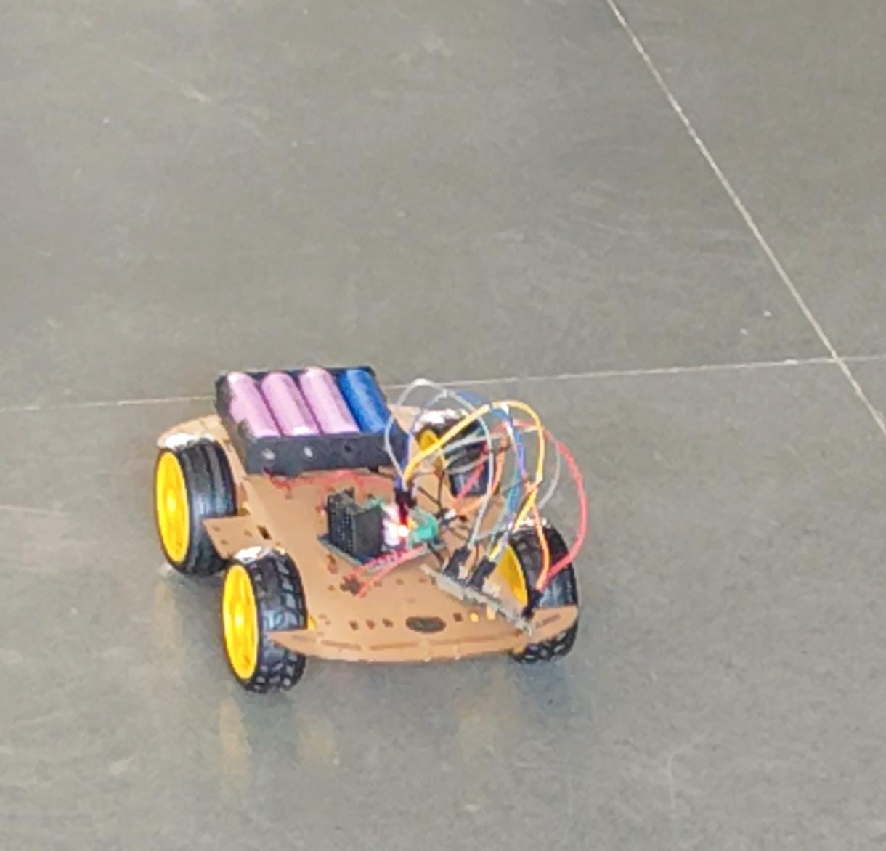
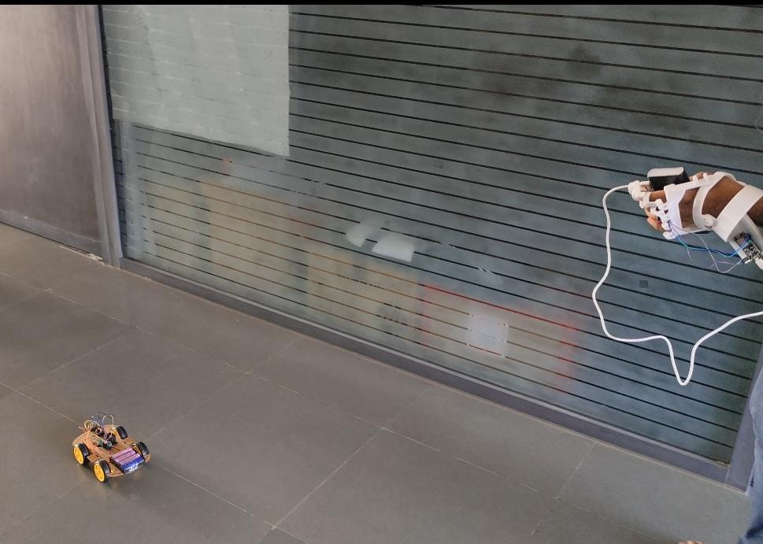

# Hand Guesture Controlled Car
A Hand Gestures Controlled Car made using MPU6050 to detect hand movements and two ESP8266 in a client-server setup. The client sends gesture data to the server, which controls the car’s movements wirelessly.

# Things Used In This Project
## Hardware Components
 ```embed
title: "Robocraze DIY 4-wheel Drive Robot Smart Car Chassis Kits with Speed Encoder For RC Car"
image: "https://m.media-amazon.com/images/I/61MpJD378VL._SL1000_.jpg"
description: "Robocraze DIY 4-wheel Drive Robot Smart Car Chassis Kits with Speed Encoder For RC Car : Amazon.in: Toys & Games"
url: "https://amzn.in/d/43pDXdl"
```
```embed
title: "SquadPixel Esp-32 Wifi, Bluetooth, Dual Core Chip Development Board (ESP-WROOM-32)"
image: "https://m.media-amazon.com/images/I/611SuZX5oYL._SL1000_.jpg"
description: "SquadPixel Esp-32 Wifi, Bluetooth, Dual Core Chip Development Board (ESP-WROOM-32) : Amazon.in: Computers & Accessories"
url: "https://amzn.in/d/bSr773R"
```
```embed
title: "Electronic Spices L298 Motor Driver Circuit Board"
image: "https://m.media-amazon.com/images/I/31nRJq29BmL._SY445_SX342_QL70_FMwebp_.jpg"
description: "Electronic Spices L298 Motor Driver Circuit Board : Amazon.in: Industrial & Scientific"
url: "https://amzn.in/d/ivnSnFy"
```
```embed
title: "B07H3XH1TB?ref=cm_sw_r_cp_ud_dp_HDZQGV51Y230VW35Z0PG&ref_=cm_sw_r_cp_ud_dp_HDZQGV51Y230VW35Z0PG&social_share=cm_sw_r_cp_ud_dp_HDZQGV51Y230VW35Z0PG"
image: "https://images-eu.ssl-images-amazon.com/images/I/41kY16MFJvL._AC_UL70_SR70,70_.jpg"
description: "Robocraze MPU-6050 Module 3 Axis Gyroscope+Accelerometer Module compatible with Arduino : Amazon.in: Industrial & Scientific"
url: "https://amzn.in/d/9KjnsFC"
```

## Software Components
```embed
title: "Software"
image: "https://content.arduino.cc/assets/arduino_logo_1200x630-01.png"
description: "Open-source electronic prototyping platform enabling users to create interactive electronic objects."
url: "https://www.arduino.cc/en/software"
```


# Circuit Diagram
### Controller Circuit
| MPU6050 | ESP32                                  |
| ------- | -------------------------------------- |
| VCC     | 3.3V or 5V (Check MPU6050 board specs) |
| GND     | GND                                    |
| SCL     | GPIO 22 (Default I2C SCL)              |
| SDA     | GPIO 21 (Default I2C SDA)              |
### Car Circuit
| **L298N Left** | **ESP32**                                                        |
| -------------- | ---------------------------------------------------------------- |
| IN1            | GPIO 32                                                          |
| IN2            | GPIO 33                                                          |
| IN3            | GPIO 25                                                          |
| IN4            | GPIO 26                                                          |
| ENA            | GPIO 27 (PWM Speed Control)                                      |
| ENB            | GPIO 14 (PWM Speed Control)                                      |
| 12V            | External Power (e.g., 12V Battery)                               |
| GND            | ESP32 GND                                                        |
| 5V             | **Do NOT connect** to ESP32 (L298N provides 5V, ESP32 uses 3.3V) |

| **L298N Right** | **ESP32**                                                        |
| --------------- | ---------------------------------------------------------------- |
| IN1             | GPIO 12                                                          |
| IN2             | GPIO 13                                                          |
| IN3             | GPIO 2                                                           |
| IN4             | GPIO 15                                                          |
| ENA             | GPIO 4 (PWM Speed Control)                                       |
| ENB             | GPIO 5 (PWM Speed Control)                                       |
| 12V             | External Power (e.g., 12V Battery)                               |
| GND             | ESP32 GND                                                        |
| 5V              | **Do NOT connect** to ESP32 (L298N provides 5V, ESP32 uses 3.3V) |

# Explanation
### **1. Client-side Code (client_side.ino)**
This code runs on an **ESP32 with an MPU6050 sensor** (accelerometer & gyroscope). It detects **tilt movements** and sends commands to another ESP32 (acting as the server, which controls the motors).

#### **How It Works:**

1. **MPU6050 Initialization**:
    - The ESP32 communicates with the MPU6050 using I2C (`Wire.begin()`).
    - It checks if the sensor is connected properly.
    
2. **Wi-Fi Connection to Car ESP32 (AP Mode)**:
    - The ESP32 connects to the Wi-Fi network hosted by the car's ESP32 (server).
    - The car’s ESP32 has a fixed IP (192.168.4.1).
    
3. **Reading Motion Data & Sending Commands**:
    - Reads accelerometer values (`ax`, `ay`) from the MPU6050.
    - Determines movement direction based on tilt:
        - **Tilt Forward → "forward"**
        - **Tilt Backward → "backward"**
        - **Tilt Right → "right"**
        - **Tilt Left → "left"**
        - **No Tilt → "stop"**
    - Sends the corresponding command to the car ESP32 over Wi-Fi.

### **2. Server-side Code (server_side.ino)**
This code runs on another **ESP32 connected to two L298N motor drivers**. It receives commands from the client ESP32 and moves the car accordingly.

#### **How It Works:**

1. **Wi-Fi Setup (AP Mode)**:
    - The ESP32 creates its own Wi-Fi **(Access Point Mode)**.
    - The client ESP32 connects to this network.
    
2. **Motor Driver Initialization**:
    - Configures GPIO pins to control **two L298N motor drivers**.
    - Initializes all motors to **stopped state**.
    
3. **Receiving Commands & Controlling Motors**:
    - Listens for incoming commands from the client ESP32.
    - Moves the car based on the command received:
        - `"forward"` → Moves all motors forward.
        - `"backward"` → Moves all motors backward.
        - `"left"` → Stops left wheels, moves right wheels forward.
        - `"right"` → Stops right wheels, moves left wheels forward.
        - `"stop"` → Stops all motors.

# BOM (Bill Of Material)
Prices of all the components are taken from the [Amazon](https://www.amazon.in/) and the price written is approximate.
- 2 x ESP32 - ₹530
- 2 x L298N Motor Driver - ₹200
- 1 x MPU6050 - ₹300
- 1 x Car Chassis - ₹700
- Jumper Wires

# Demo



